Following are the API calls allowed. 

#### Sign Up

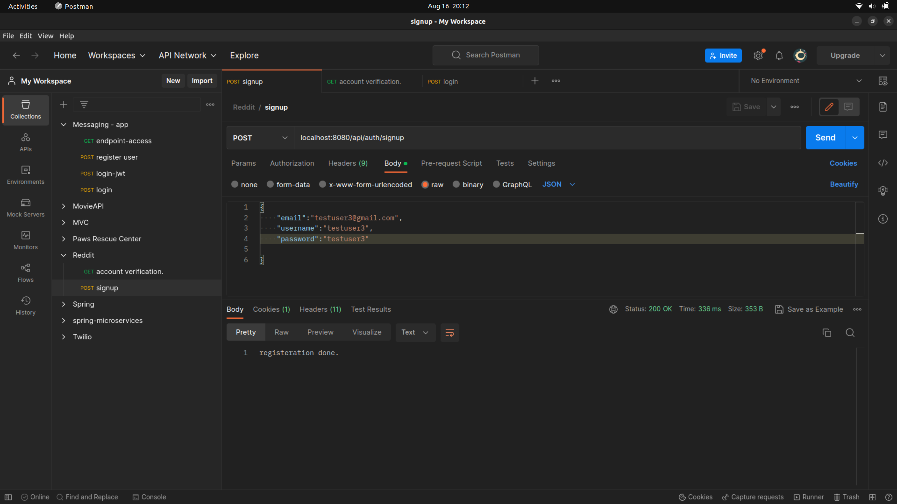

```
Method: Signup 
Protocol: POST
    
    /api/auth/signup
    {
        {
            "email":"<>",
            "username":"<>",
            "password":"<>"
        }
    }

```
> After the user is registered, we send a verification mail on a mock third party service
mail service as mailTrap. 
> Configurations can be found in application.properties.
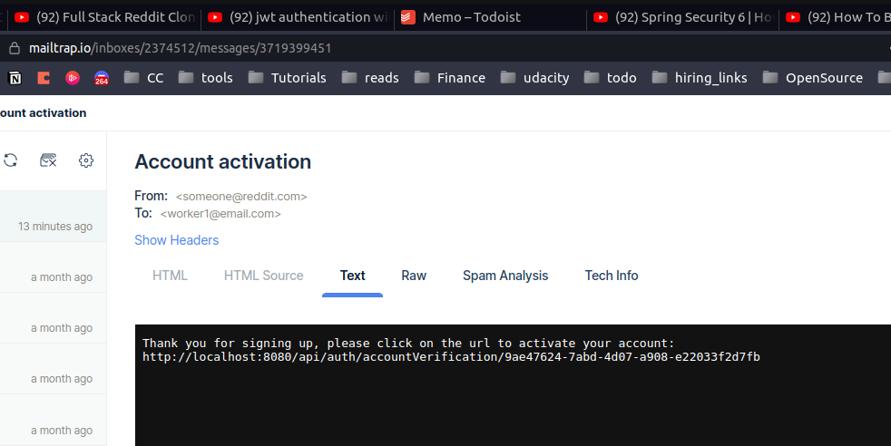


> Use the <strong>Verification Code</strong> sent to the mail id to verify the user: on url 
```
Method: Account Verification 
Protocol: GET
    
    /api/auth/accountVerification/{code}

```


#### Login

Method: POST

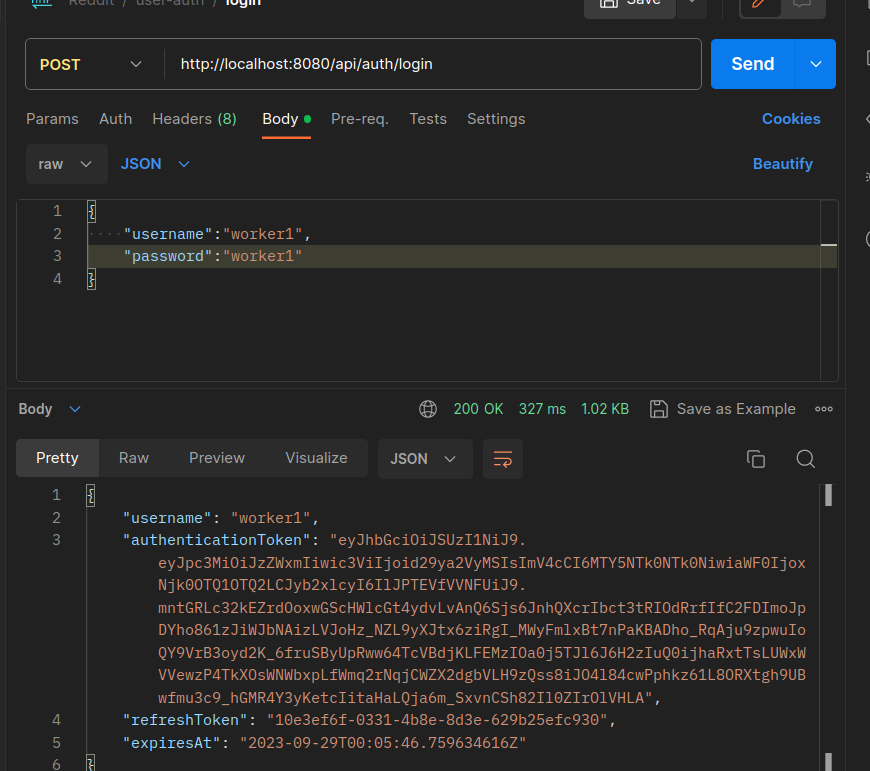
```
http://localhost:8080/api/auth/login
{
    "userName":"<>",
    "password":"<>"
}
```

If users try to login without verifying themselves, we send message as follows:

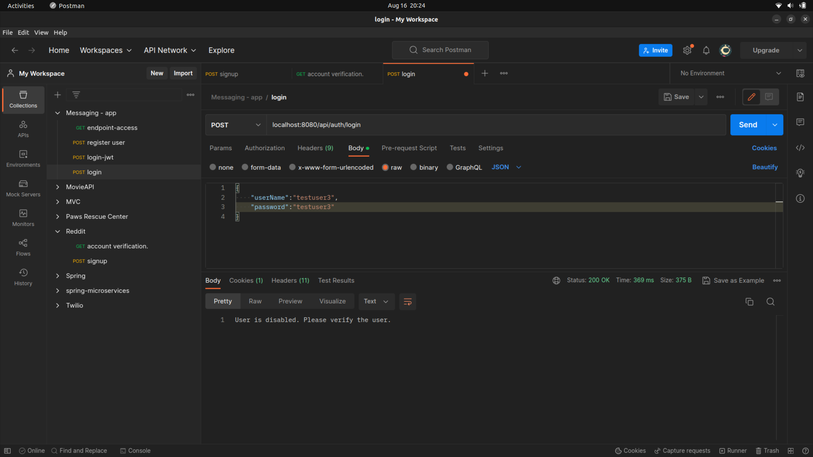

Using the authentication token for all further calls, in order to validate the user making the call before executing the request each time.

#### Refresh token

JWT tokens have a longer expiry. 
Refresh tokens are recalculated and used in span of 5 mins.

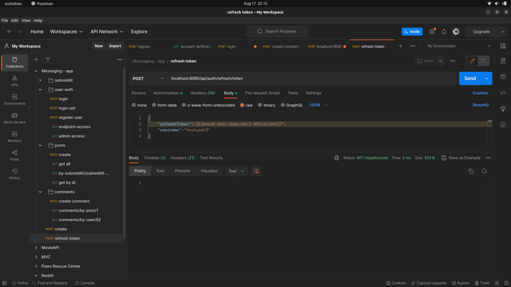

### TOPICS

| Calls                | Method   | URL                 |
| :------------------: | :------: | :--------------:    |
| Get All Subreddits   | GET      | /api/topic      |
| Create Subreddit     | POST     | /api/topic      |
| Get One Subreddit    | GET      |	/api/topic/{id} |

##### Create Subreddit
```
http://localhost:8080/api/topic
{
    "name":"Subreddit2",
    "description":"description2"
}
```


#### Get Subreddit. 


##### Get by id


### POSTS

API calls for posts.

| Calls                | Method   | URL                 |
| :------------------: | :------: | :--------------:    |
| /api/posts |	 POST|	createPost |
| /api/posts/ |	GET | getAllPosts |
| /api/posts/{id} | GET | getPost |
| /api/posts/by-topic/{id} |GET |getPostsBySubreddit |
| /api/posts/by-user/{name} | GET |	getPostsByUsername |

#### Create Post

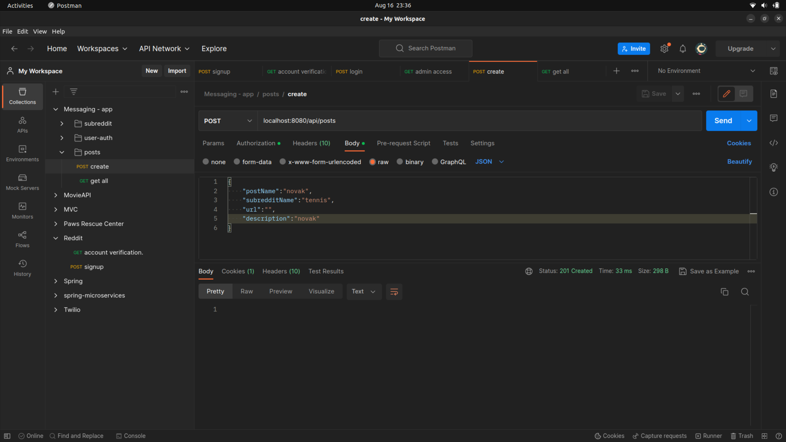

#### Get Posts

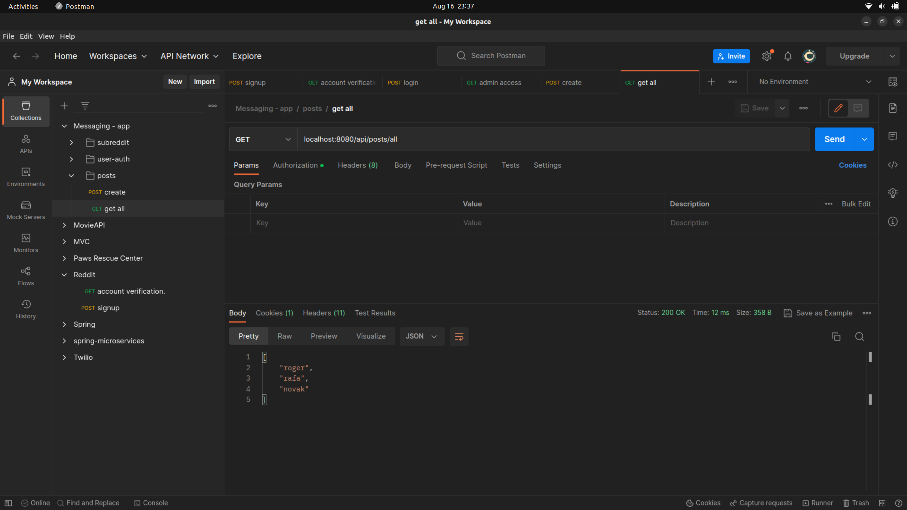

#### By id
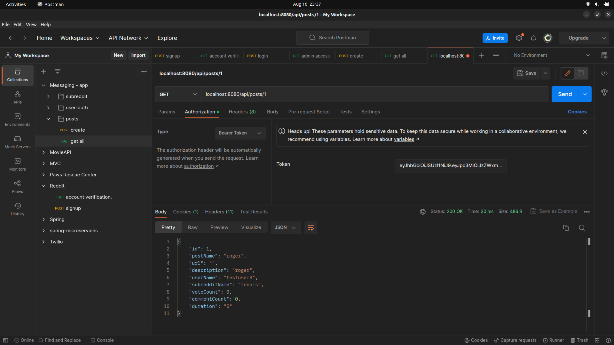

#### By topic
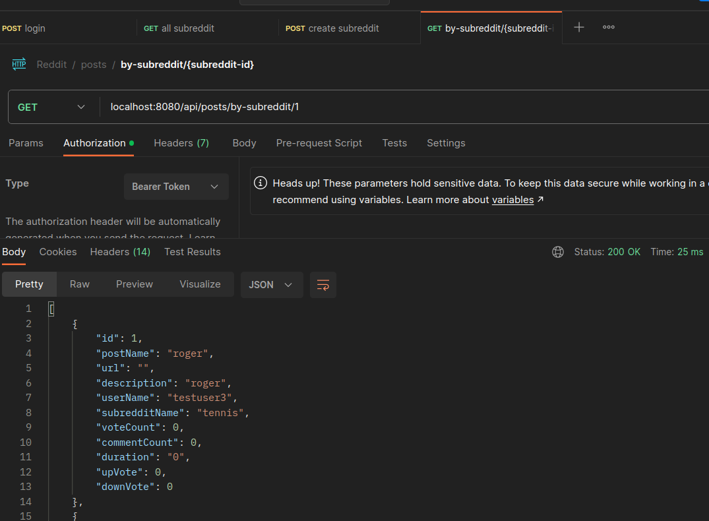

#### COMMENTS

| Endpoint                | Method   | Calls To                 |
| :------------------: | :------: | :--------------:    |
| /api/comments |	 POST|	createPost |
| /api/comments/by-post/{postId} |	GET | get By Post |
| /api/comments/by-user/{userName} | GET | get comments by user |

1. ADD comment

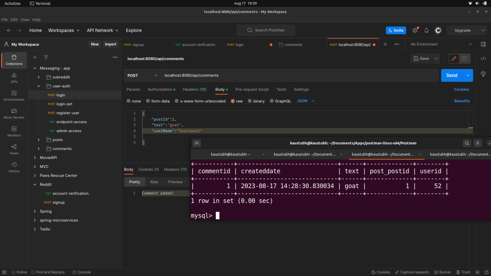

```
"postId":"<>",
"text":"Comment 3",
"userName":"<>"
```

Fetch comments by post.

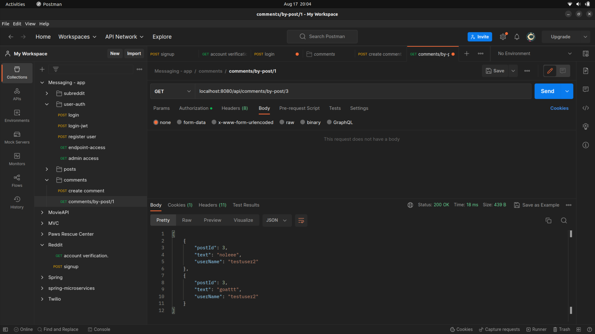

Fetch comments by user.

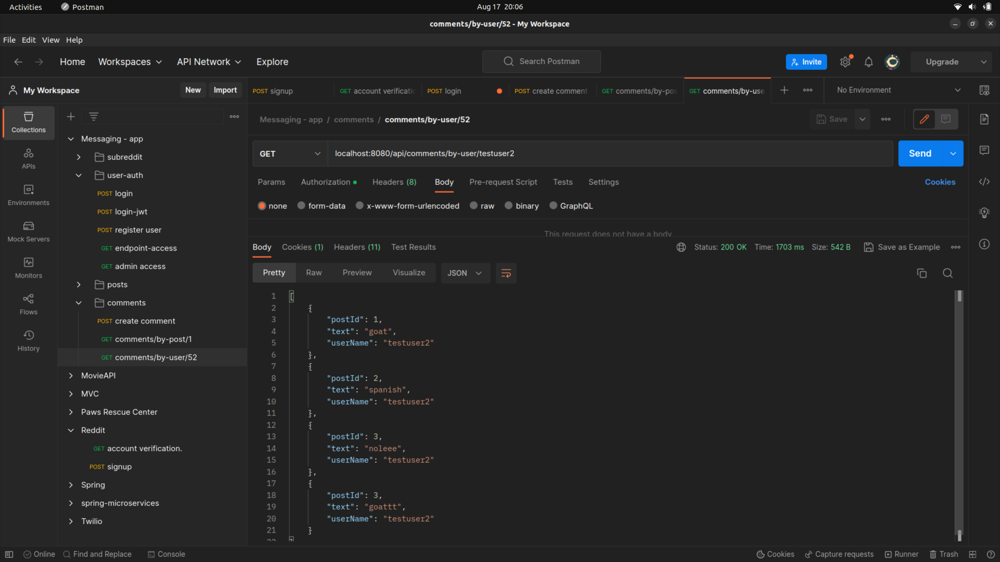

#### VOTE

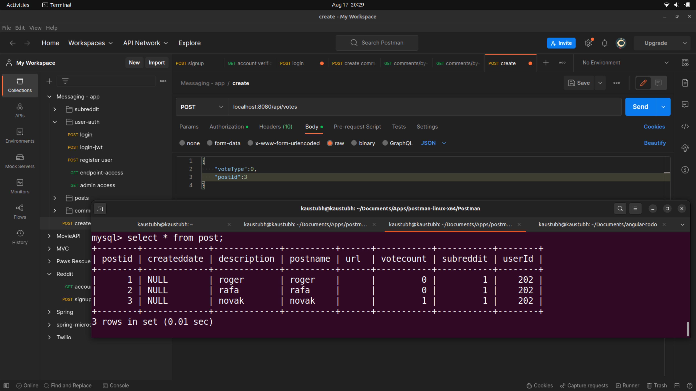


Add Vote : POST method.
```
{
    "postId":27,
    "voteType":"UPVOTE"
}
```

#### Refresh tokens

/api/auth/refresh/token
"refreshToken":<>,
"username":<>

#### Logout

/api/auth/logout
"refreshToken":<>,
"username":<>
