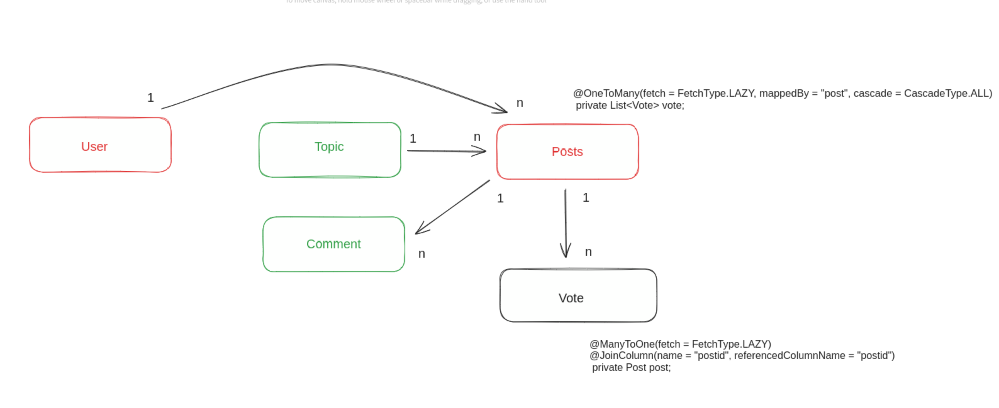

Model Diagram:

Flows:

Sign up flow.
User passes on email/username, password - stored to the database.
A verification code is generated - and stored to the database.

Account Verification flow.
The account activation link sent to the user with the verification code.
Once the user makes a get call with the verification code, we retrieve the user and enable them.

Login
Response returns a token - to be used in all the subsequent requests made.

Problems faced:
1. @Column(unique=true) does not guarantee a unique entry for any column.
   Additionally, we have to perform the following query:
   ALTER TABLE Customer ADD CONSTRAINT customer_name_unq UNIQUE (name);
   
   To handle that we've to catch the following exception: DataIntegrityViolationException
 