## Overview 

This a backend project of reddit clone application using spring boot technologies such as spring data jpa, spring security and authenticates users via JWT tokens with MySQL DB.

The schema for the same can be found in file `schema.sql` in the root directory. 

Following are the API calls allowed. 

#### Sign Up

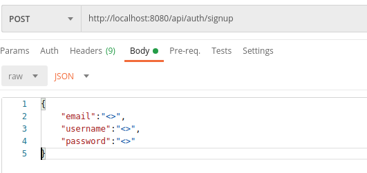

```
Signup - Method:POST
    
    http://localhost:8080/api/auth/signup
    {
        {
            "email":"<>",
            "username":"<>",
            "password":"<>"
        }
    }

```
Setting up mailTrap (configured in application.properties) to receive the verification code. Authorize the user via the link sent
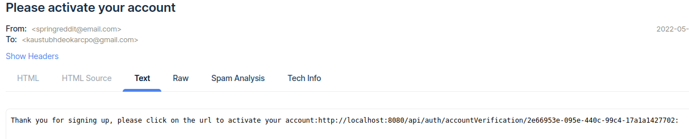

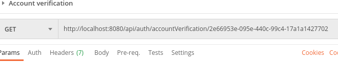

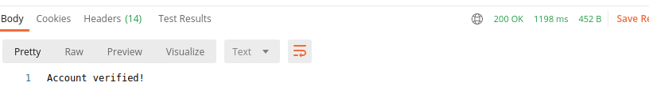

#### Login

Method: POST

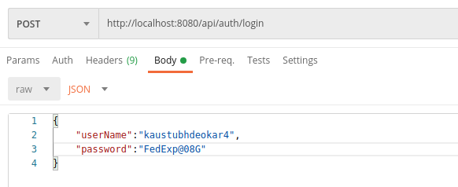

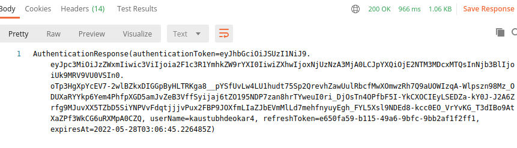
```
http://localhost:8080/api/auth/login
{
    "userName":"<>",
    "password":"<>"
}
```
Using the authentication token for all further calls, in order to validate the user making the call before executing the request each time.

#### SUBREDDITS

| Calls                | Method   | URL                 |
| :------------------: | :------: | :--------------:    |
| Get All Subreddits   | GET      | /api/subreddit      |
| Create Subreddit     | POST     | /api/subreddit      |
| Get One Subreddit    | GET      |	/api/subreddit/{id} |


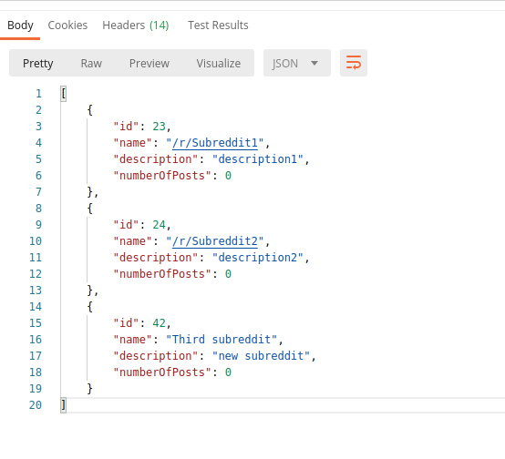

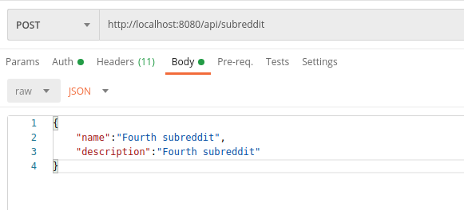

Create subreddit : POST
```
http://localhost:8080/api/subreddit
{
    "name":"Subreddit2",
    "description":"description2"
}
```
Result: Post name, description:

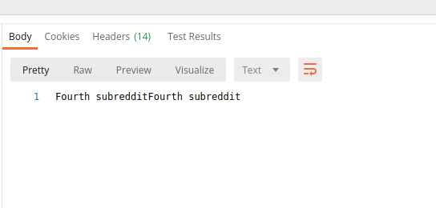

#### POSTS

API calls for posts.

| Calls                | Method   | URL                 |
| :------------------: | :------: | :--------------:    |
| /api/posts |	 POST|	createPost |
| /api/posts/ |	GET | getAllPosts |
| /api/posts/{id} | GET | getPost |
| /api/posts/by-subreddit/{id} |GET |getPostsBySubreddit |
| /api/posts/by-user/{name} | GET |	getPostsByUsername |


Result

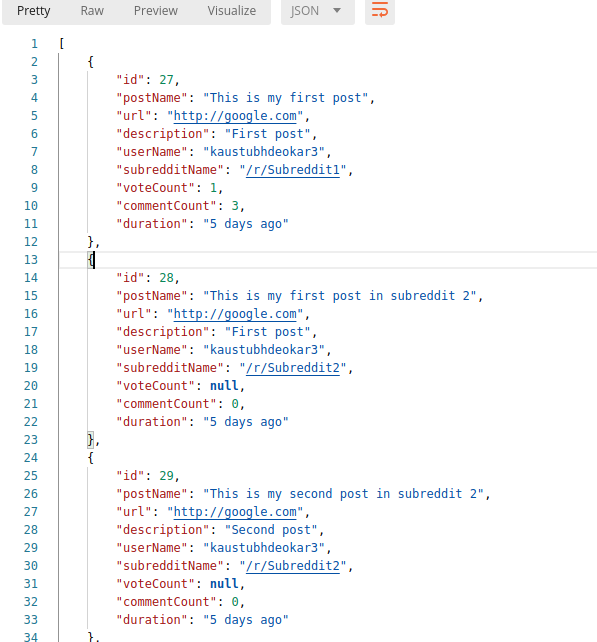

Post query.

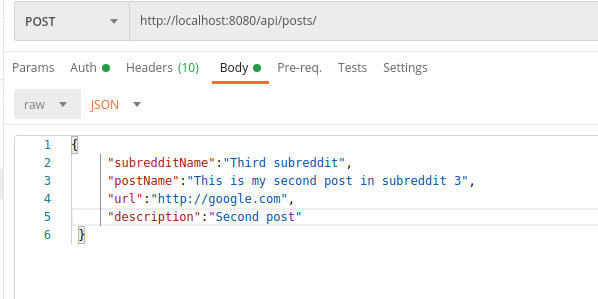

```
POST
 {
     "subredditName":"/r/Subreddit1",
     "postName":"This is my third post in subreddit 1",
     "url":"http://google.com",
     "description":"third post"
 }

```

Result

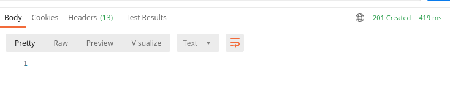

Result By Id.


#### COMMENTS

| Endpoint                | Method   | Calls To                 |
| :------------------: | :------: | :--------------:    |
| /api/comments |	 POST|	createPost |
| /api/comments/by-post/{postId} |	GET | get By Post |
| /api/comments/by-user/{userName} | GET | get comments by user |

1. ADD comment


```
"postId":"<>",
"text":"Comment 3",
"userName":"<>"
```

Fetch comments by post.


Fetch comments by user.


#### VOTE


Add Vote : POST method.
```
{
    "postId":27,
    "voteType":"UPVOTE"
}
```

#### Refresh tokens

/api/auth/refresh/token
"refreshToken":<>,
"username":<>

#### Logout

/api/auth/logout
"refreshToken":<>,
"username":<>

Extra links

## Lombok
Lombok annotations such as @Data, @AllArgsConstructor, and @NoArgsConstructor generate the corresponding getters, setters, 
constructors at runtime.

[Configure Lombok](https://www.baeldung.com/lombok-ide)

## MySQL configuration
[Configuration link](https://dev.to/gsudarshan/how-to-install-mysql-and-workbench-on-ubuntu-20-04-localhost-5828)

## MySql workbench.
[Setup Video](https://www.youtube.com/watch?v=7_YrwTOPl9w)   
    
## SMTP server 
[mailtrap](https://mailtrap.io) 


## References
[Spring Boot Reddit Clone](https://programmingtechie.com/2020/05/14/building-a-reddit-clone-with-spring-boot-and-angular/)

### Tips
Spring recommends using constructor injection over field injection.
Async mail send can be simply enabled by using annotations, @EnableAsync & @Async, for much heavier use cases, we can 
use message queues.  

