## Overview 

This a backend project of Blogging application using spring boot technologies such as spring data jpa, spring security and authenticates users via JWT tokens with MySQL DB.

The schema for the same can be found in file `schema.sql` in the root directory.

Following are the API calls allowed. 

#### Sign Up

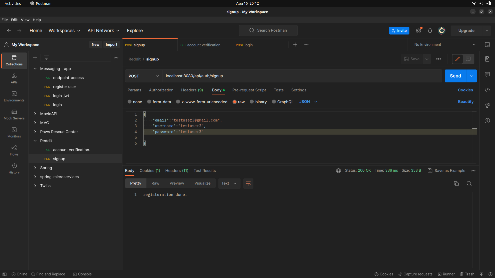

```
Method: Signup 
Protocol: POST
    
    /api/auth/signup
    {
        {
            "email":"<>",
            "username":"<>",
            "password":"<>"
        }
    }

```
> After the user is registered, we send a verification mail on a mock third party service
mail service as mailTrap. 
> Configurations can be found in application.properties.
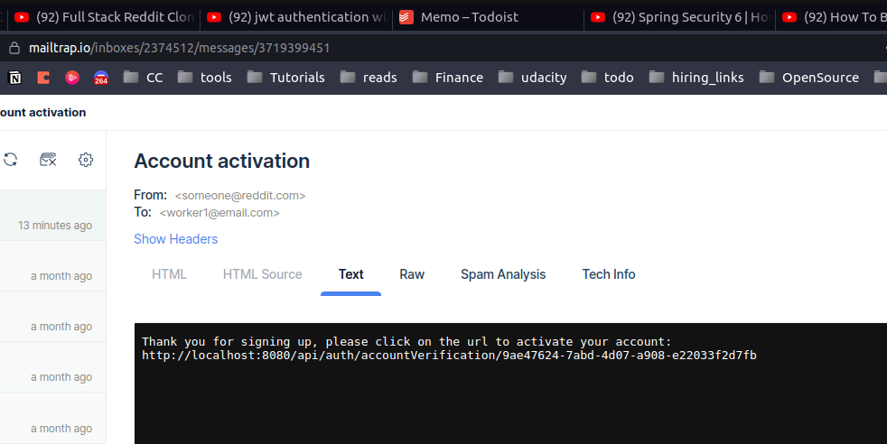


> Use the <strong>Verification Code</strong> sent to the mail id to verify the user: on url 
```
Method: Account Verification 
Protocol: GET
    
    /api/auth/accountVerification/{code}

```

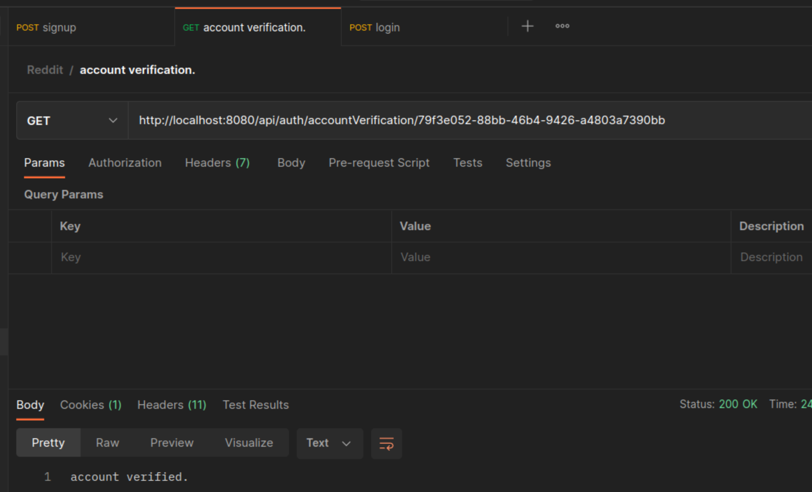

#### Login

Method: POST

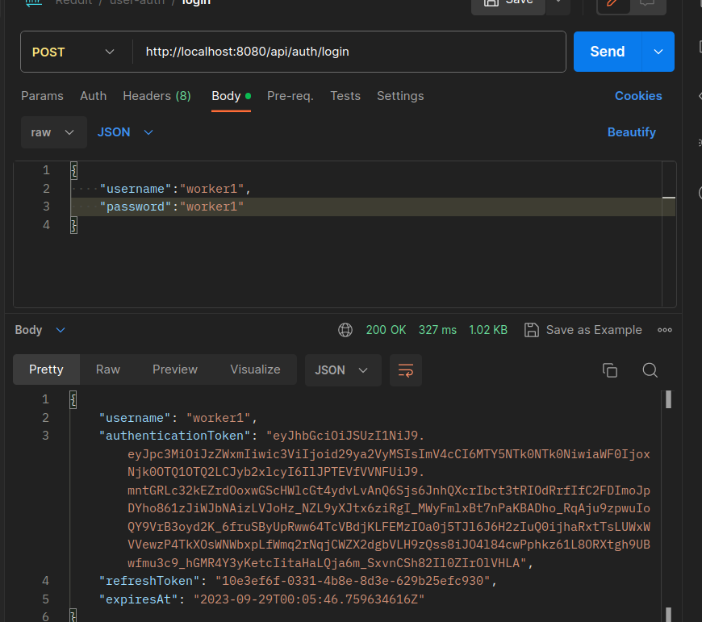
```
http://localhost:8080/api/auth/login
{
    "userName":"<>",
    "password":"<>"
}
```

If users try to login without verifying themselves, we send message as follows:

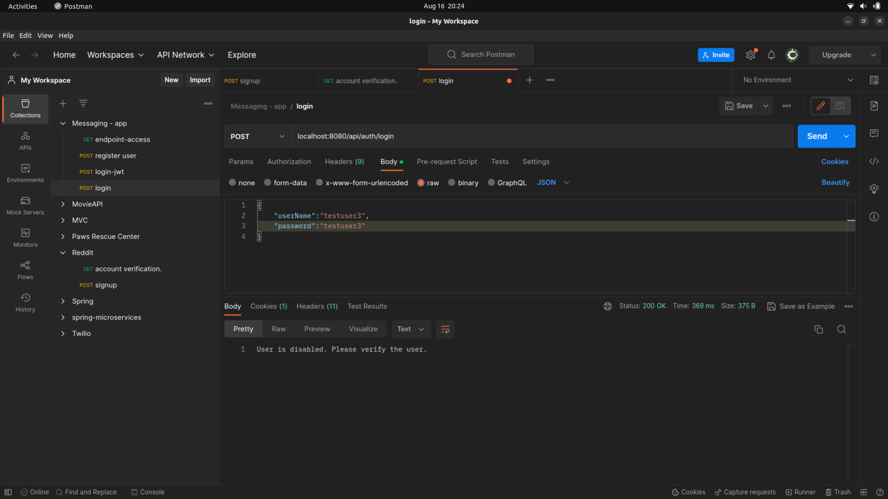

Using the authentication token for all further calls, in order to validate the user making the call before executing the request each time.

#### TOPICS

| Calls                | Method   | URL                 |
| :------------------: | :------: | :--------------:    |
| Get All Subreddits   | GET      | /api/subreddit      |
| Create Subreddit     | POST     | /api/subreddit      |
| Get One Subreddit    | GET      |	/api/subreddit/{id} |

##### Create Subreddit
```
http://localhost:8080/api/subreddit
{
    "name":"Subreddit2",
    "description":"description2"
}
```

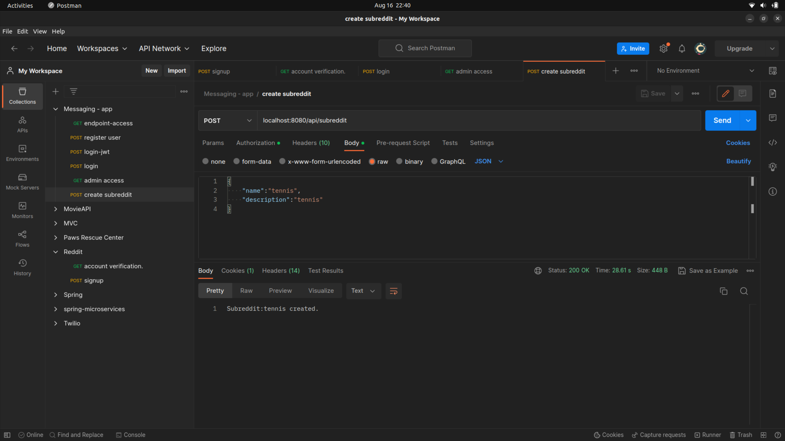

#### Get Subreddit. 

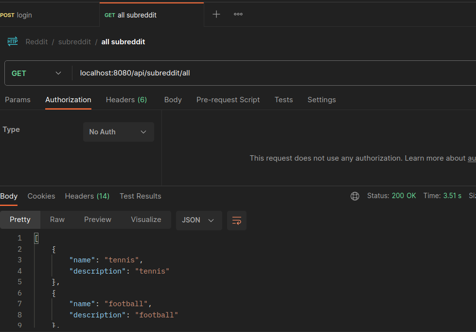

##### Get by id

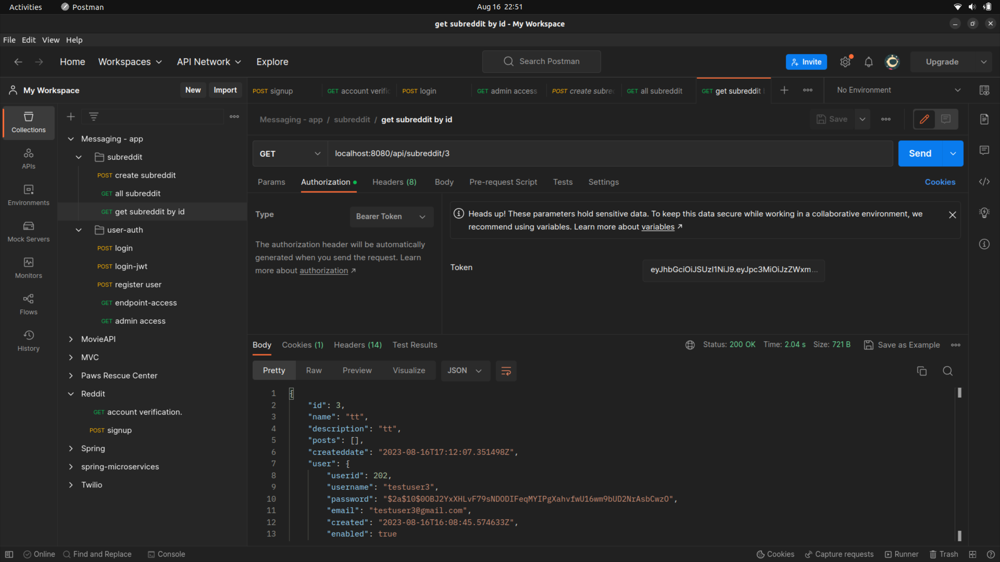

### POSTS

API calls for posts.

| Calls                | Method   | URL                 |
| :------------------: | :------: | :--------------:    |
| /api/posts |	 POST|	createPost |
| /api/posts/ |	GET | getAllPosts |
| /api/posts/{id} | GET | getPost |
| /api/posts/by-subreddit/{id} |GET |getPostsBySubreddit |
| /api/posts/by-user/{name} | GET |	getPostsByUsername |

#### Create Post

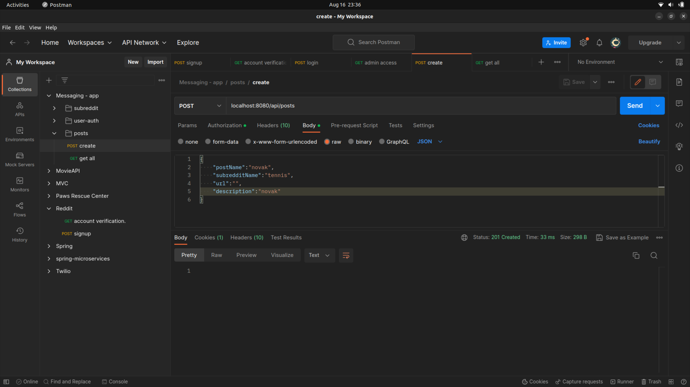

#### Get Posts

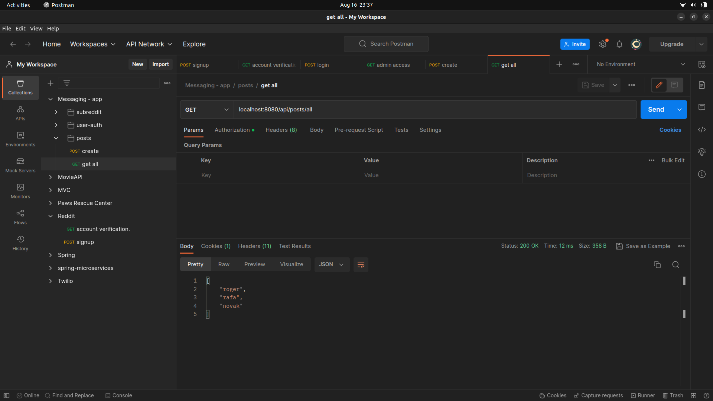

#### By id
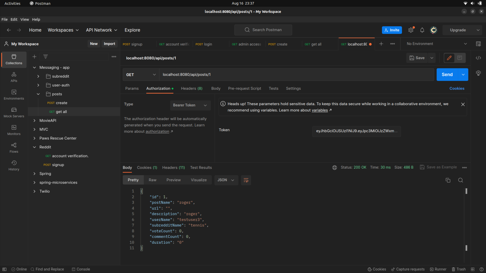

#### By subreddit
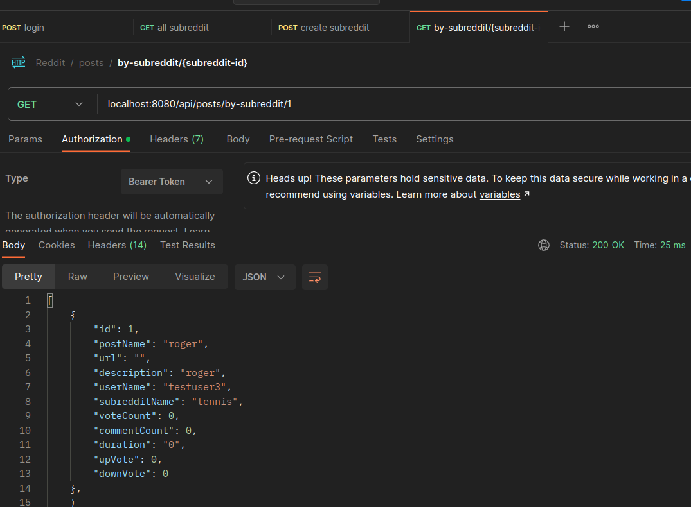

#### COMMENTS

| Endpoint                | Method   | Calls To                 |
| :------------------: | :------: | :--------------:    |
| /api/comments |	 POST|	createPost |
| /api/comments/by-post/{postId} |	GET | get By Post |
| /api/comments/by-user/{userName} | GET | get comments by user |

1. ADD comment

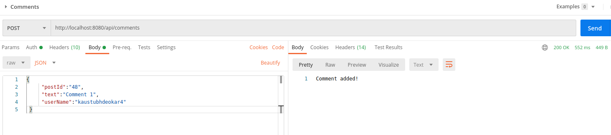

```
"postId":"<>",
"text":"Comment 3",
"userName":"<>"
```

Fetch comments by post.

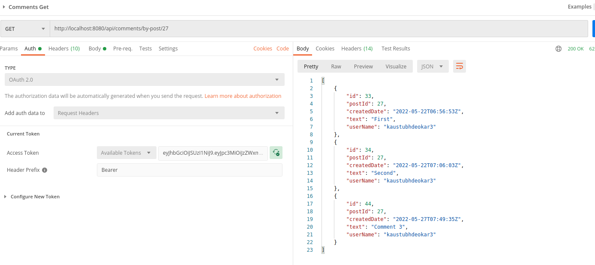

Fetch comments by user.

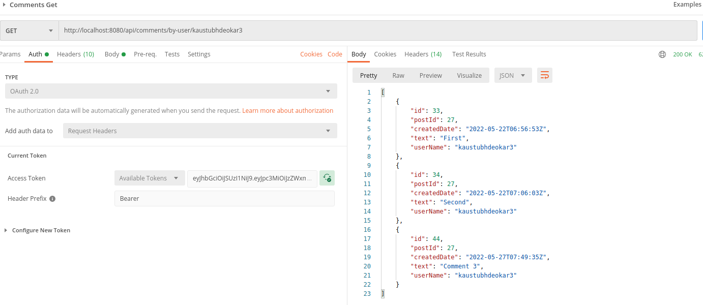

#### VOTE

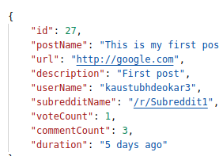


Add Vote : POST method.
```
{
    "postId":27,
    "voteType":"UPVOTE"
}
```

#### Refresh tokens

/api/auth/refresh/token
"refreshToken":<>,
"username":<>

#### Logout

/api/auth/logout
"refreshToken":<>,
"username":<>

Extra links

## Lombok
Lombok annotations such as @Data, @AllArgsConstructor, and @NoArgsConstructor generate the corresponding getters, setters, 
constructors at runtime.

[Configure Lombok](https://www.baeldung.com/lombok-ide)

## MySQL configuration
[Configuration link](https://dev.to/gsudarshan/how-to-install-mysql-and-workbench-on-ubuntu-20-04-localhost-5828)

## MySql workbench.
[Setup Video](https://www.youtube.com/watch?v=7_YrwTOPl9w)   
    
## SMTP server 
[mailtrap](https://mailtrap.io) 


## References
[Spring Boot Reddit Clone](https://programmingtechie.com/2020/05/14/building-a-reddit-clone-with-spring-boot-and-angular/)

### Tips
Spring recommends using constructor injection over field injection.
Async mail send can be simply enabled by using annotations, @EnableAsync & @Async, for much heavier use cases, we can 
use message queues.  

